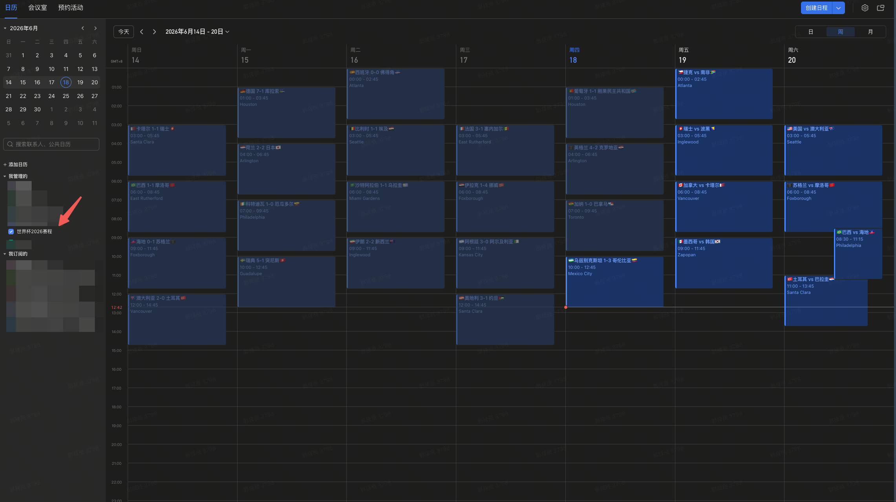

# fifa2026calendar-larkcli

通过用户自己的 `lark-cli`，一键创建个人飞书日历 `世界杯2026赛程 ⚽️`，并实时抓取 2026 世界杯最新赛程和比分导入。

特点：

- 每次运行都会重新查询 Wikipedia 当前赛事页面，不使用运行时缓存
- 已结束比赛把比分写进标题
- 未结束比赛保留当前对阵或淘汰赛占位
- 使用 `lark-cli --as user` 创建共享日历并写入赛程

## 前置条件

- Node.js 20+
- 已安装并配置 `lark-cli`
- 已完成用户身份授权，且至少包含这些 scope：
  - `calendar:calendar:create`
  - `calendar:calendar:read`
  - `calendar:calendar.event:create`

可先自检：

```bash
lark-cli auth status
```

## 直接运行

推荐直接从 GitHub 运行，不依赖 npm 发包：

```bash
npx github:DiabloZhang/fifa2026calendar-larkcli install --dry-run
npx github:DiabloZhang/fifa2026calendar-larkcli install
```

如果你想给朋友一个更低门槛的一键入口，可以直接用：

```bash
curl -fsSL https://raw.githubusercontent.com/DiabloZhang/fifa2026calendar-larkcli/main/install.sh | bash
```

这个脚本会：

- 检查是否已安装 `Node.js` / `npm`
- 自动安装 `lark-cli`（若本机缺失）
- 提示先完成 `lark-cli` 初始化与授权
- 自动执行世界杯日历导入

也可以先拉到本地再执行：

```bash
git clone https://github.com/DiabloZhang/fifa2026calendar-larkcli.git
cd fifa2026calendar-larkcli
node src/cli.js install
```

## 常用参数

```bash
fifa2026calendar-larkcli install \
  --calendar-name "世界杯2026赛程" \
  --permissions private
```

只看将要创建什么，不真正写入飞书：

```bash
fifa2026calendar-larkcli install --dry-run
```

如果已存在同名日历，允许删除并重建：

```bash
fifa2026calendar-larkcli install --replace-existing --yes
```

## 导入规则

- 比赛标题：
  - 已赛：`🇦🇷阿根廷 3-1 巴西🇧🇷`
  - 未赛：`🇦🇷阿根廷 vs 巴西🇧🇷`
  - 淘汰赛未确定：`A组第2 vs B组第2`
- 比赛时间：
  - 按赛事举办地当地开球时间写入
- 描述：
  - 阶段、场馆、来源页面、抓取时间

## 导入效果

导入完成后，飞书里会生成一个名为 `世界杯2026赛程 ⚽️` 的个人日历，效果如下：



## 注意

- 本工具每次运行都会重新抓取线上页面；不会读取本地缓存结果。
- 默认不会自动删除已有同名日历，避免误删。若你想覆盖重建，请显式传 `--replace-existing --yes`。
- 数据源当前使用 Wikipedia 2026 世界杯各小组页、淘汰赛页与决赛页原始 wikitext。
- 如果未来补发 npm 包，再额外支持 `npx fifa2026calendar-larkcli install`。
